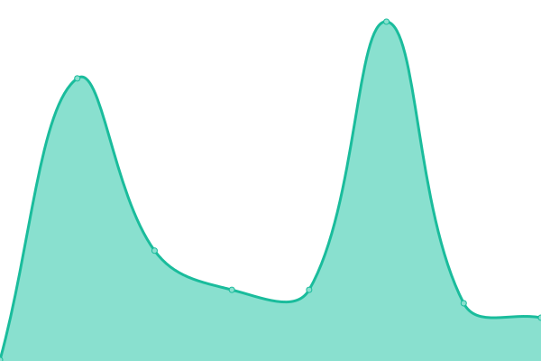
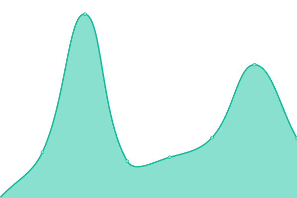

# [📈 Live Status](https://up.buildnatively.com): <!--live status--> **🟧 Partial outage**

This repository contains the open-source uptime monitor and status page for [$OWNER](https://up.buildnatively.com), powered by [Upptime](https://github.com/upptime/upptime).

With [Upptime](https://upptime.js.org), you can get your own unlimited and free uptime monitor and status page, powered entirely by a GitHub repository. We use [Issues](https://github.com/$OWNER/$REPO/issues) as incident reports, [Actions](https://github.com/$OWNER/$REPO/actions) as uptime monitors, and [Pages](https://up.buildnatively.com) for the status page.

<!--start: status pages-->
<!-- This summary is generated by Upptime (https://github.com/upptime/upptime) -->
<!-- Do not edit this manually, your changes will be overwritten -->
<!-- prettier-ignore -->
| URL | Status | History | Response Time | Uptime |
| --- | ------ | ------- | ------------- | ------ |
|  [App](https://app.buildnatively.com/) | 🟩 Up | [app.yml](https://github.com/buildnatively/status/commits/HEAD/history/app.yml) | 

 985ms
     
 | 

<a href="https://up.buildnatively.com/history/app">100.00%</a>
    

|  Builder | 🟩 Up | [builder.yml](https://github.com/buildnatively/status/commits/HEAD/history/builder.yml) | 

 366ms
     
 | 

<a href="https://up.buildnatively.com/history/builder">100.00%</a>
    

|  [Documentation](https://docs.buildnatively.com) | 🟩 Up | [documentation.yml](https://github.com/buildnatively/status/commits/HEAD/history/documentation.yml) | 

 646ms
     
 | 

<a href="https://up.buildnatively.com/history/documentation">100.00%</a>
    

|  [AppStore Connect](https://appstoreconnect.apple.com/) | 🟥 Down | [app-store-connect.yml](https://github.com/buildnatively/status/commits/HEAD/history/app-store-connect.yml) | 

 2325ms
     
 | 

<a href="https://up.buildnatively.com/history/app-store-connect">100.00%</a>
    

|  [Google Play Console](https://play.google.com/console/developer) | 🟩 Up | [google-play-console.yml](https://github.com/buildnatively/status/commits/HEAD/history/google-play-console.yml) | 

 278ms
     
 | 

<a href="https://up.buildnatively.com/history/google-play-console">100.00%</a>
    

<!--end: status pages-->

[**Visit our status website →**](https://up.buildnatively.com)

## 📄 License

- Powered by: [Upptime](https://github.com/upptime/upptime)
- Code: [MIT](./LICENSE) © [$OWNER](https://up.buildnatively.com)
- Data in the `./history` directory: [Open Database License](https://opendatacommons.org/licenses/odbl/1-0/)
